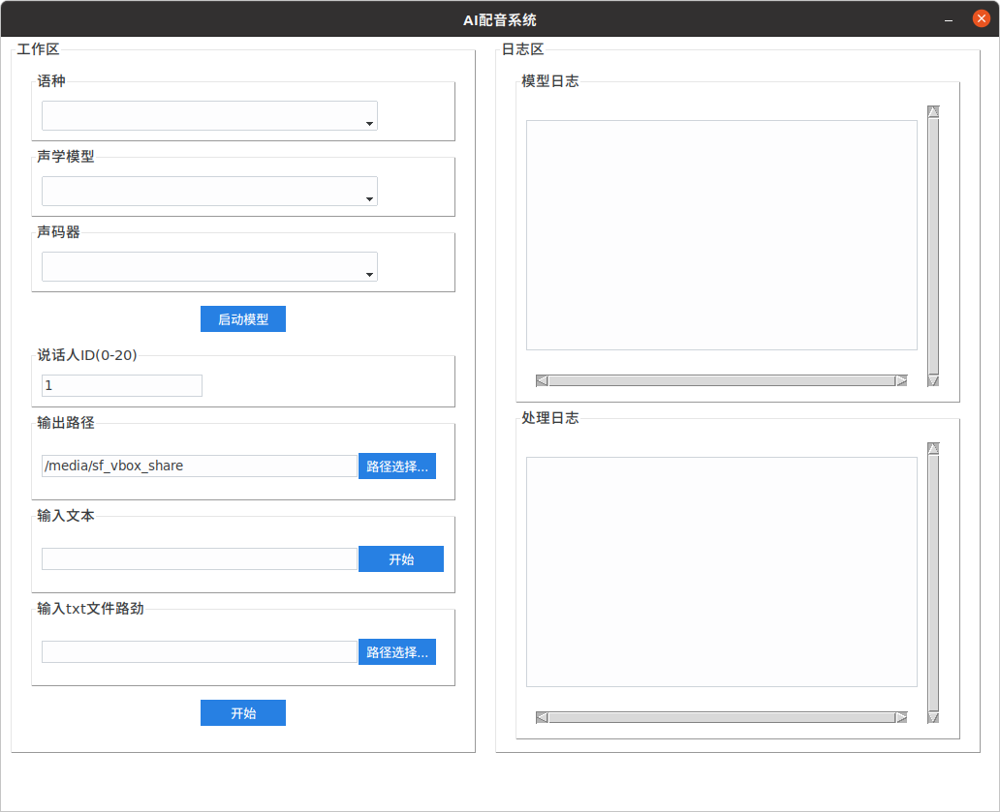

# PaddleDubbing

#### 介绍
模型能力来自基于百度飞桨平台开源的paddlespeech语音项目，增加GUI操作界面，方便使用。
可以选择模型，说话人类型；可以单句合成也可以批量合成。支持中文和英文，不支持中英混合。
- 界面



## v1.0

```
sh generate_audio.sh trans.txt test/
```

## v2.0

#### 优化

- 针对paddlespeech中给出的demo每次调用都需要重新加载一次模型的问题进行优化；
- 增加了log重定向；

#### 使用

- 环境搭建

```commandline
virtualenv -p python venv
source venv/bin/activate

sh setup.sh
```

- 操作

第一步:选择并启动模型
```
1、选则语种
2、选择声学模型： fastspeech2_aishell3
3、选择声码器： pwgan_aishell3
4、点击启动模型

注意：声学模型和声码器的名称下划线后面表示的是训练模型所使用后的数据集，两者需要保持一致才能得到质量好的合成声音；
启动模型时，如果模型没有下载，会自动下载模型，需要等待一会儿。模型加载完成后按钮会变灰色，并显示模型加载完成。
右侧框中为加载模型时的og输出。
```

第二步：配置输出地址，并输入内容
```
5、配置输出地址：可直接输入，也可以点击右侧按钮选择
6、输入文本：输入一句话
7、输入文本文件：导入文件地址
8、点击开始

右侧框图中将输出合成的音频信息。
```

- 文本文件格式:txt文本

```
这里是文本的格式。
可以带标点符号
一行文字合成一个音频文件。语速可以通过标点微调。
保存的音频文件名就包括文本内容，且开头会加上行序
```

#### 参考资料

- [用Python实现带GUI 的exe](https://blog.csdn.net/miffy2017may/article/details/103391855)
- [PaddleSpeech](https://github.com/PaddlePaddle/PaddleSpeech)
