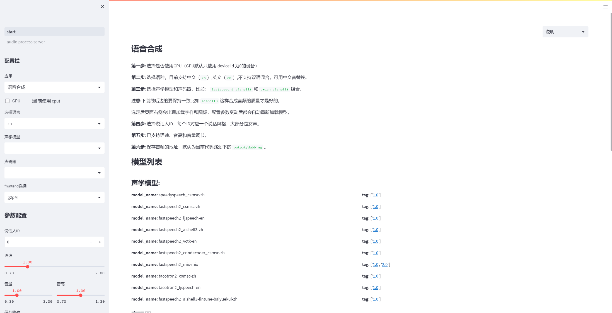
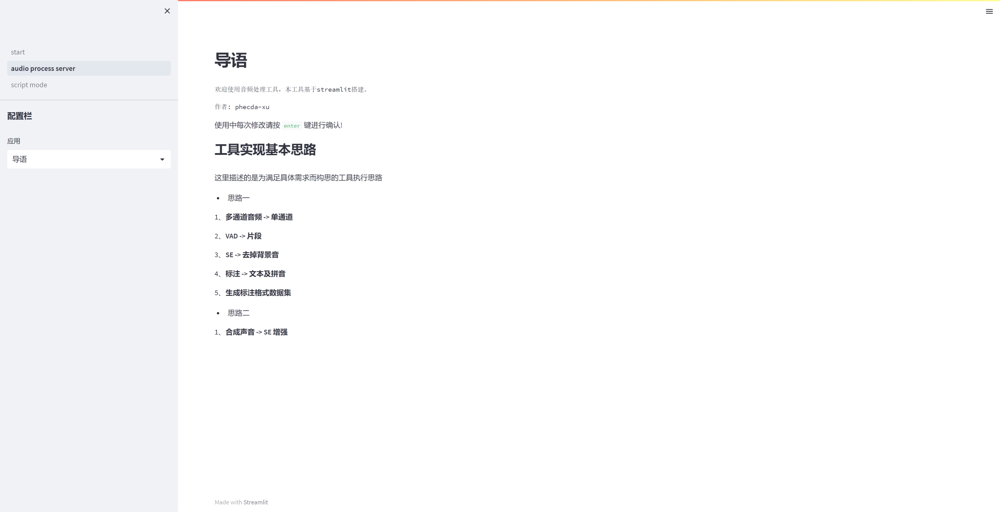

# PaddleDubbing

#### 介绍

基于 streamlit 搭建的可视化界面，模型能力来自 [paddlespeech](https://github.com/PaddlePaddle/PaddleSpeech)；
可以灵活配置、调用模型；可以单句合成也可以批量合成。支持中文和英文，不支持中英混合。

- 合成界面


- 数据处理界面


- 视频vlog

[【前期准备工作】](https://www.bilibili.com/video/BV1134y117Jr/)

[【v1.0版本】](https://www.bilibili.com/video/BV1dq4y147Gn/)

[【v2.0版本】](https://www.bilibili.com/video/BV1zq4y1x71Y/)


- 基础环境搭建

```
# c++编译环境
apt-get update
sudo apt install build-essential

# python-dev 出现 'python.h' 找不到的错误时安装这个，版本与系统 python 的版本对应
# sudo apt-get install python3.8-dev

# python 环境 version>=3.6 
# python -m pip install --upgrade pip
```

- 虚拟环境

```commandline
virtualenv -p python venv
source venv/bin/activate

sh setup.sh gpu
```


## v1.0

```
见 master 分支
```

## v2.0


```
见 master 分支
```

## v3.0

#### 优化

- 优化了本地fintune模型的加载;
- 优化了部分代码逻辑;
- 新增数据切分、标注处理页面，可直接生成 fintune 所需的数据形式;
- 优化部分页面显示;
- 增加部分说明信息;

#### 使用

- 启动

```
streamlit run start.py
```

#### 待做

- v3.0 视频 vlog;
- Dockerfile

#### 参考资料

- [streamlit api](https://docs.streamlit.io/library/api-reference#id1)
- [PaddleSpeech](https://github.com/PaddlePaddle/PaddleSpeech)
